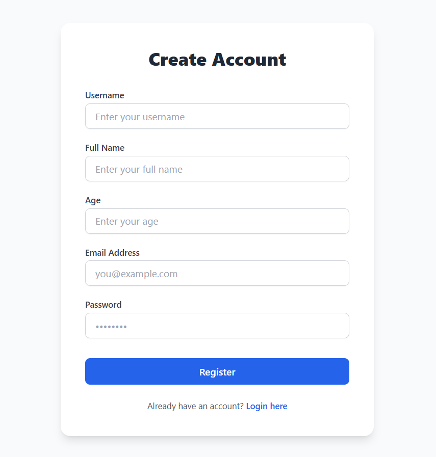

# Auth Post App

A full-stack Node.js application featuring user authentication, post creation, and like/unlike functionality—styled with Tailwind CSS and enhanced with 3D backgrounds via Three.js.

##  Screenshots

  
  
  
  
  
  

---

##  Live Preview

_Not deployed yet_

---

##  Features

- **User Registration & Login** with JWT stored in HTTP-only cookies  
- **Password Hashing** via bcrypt  
- **Protected Routes** with `isLoggedIn` middleware  
- **Create, Edit & View Posts**  
- **Like / Unlike** toggle per post  
- **Conditional “Edit” Link** visible only to post owners  
- **Tailwind CSS** for responsive styling  
- **Three.js** 3D animation on the registration page  
- **MongoDB & Mongoose** for data persistence  

---

## 🛠 Tech Stack

| Technology   | Purpose                       |
|--------------|-------------------------------|
| Node.js      | JavaScript runtime            |
| Express.js   | Server framework              |
| MongoDB      | Database (via Mongoose)       |
| JWT          | Authentication                |
| bcrypt       | Secure password hashing       |
| EJS          | Templating engine             |
| Tailwind CSS | Frontend styling              |
| Three.js     | 3D background animation       |

---

   
